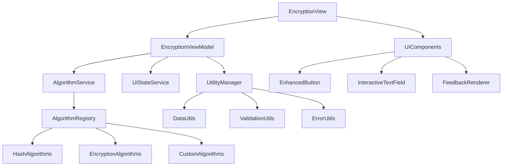

# 加解密功能优化设计文档

## 概述

本设计文档基于对现有加解密功能代码的深入分析，针对三个核心优化目标：UI用户体验增强、代码重复优化、以及可扩展架构设计。通过重构现有实现，我们将构建一个更加用户友好、代码简洁且易于扩展的加解密系统。

## 架构设计

### 整体架构图



## 组件和接口设计

### 1. UI用户体验增强

#### 1.1 增强的按钮组件 (EnhancedToolButton)

**设计目标：** 提供丰富的视觉反馈和交互状态

```swift
struct EnhancedToolButton: View {
    enum State {
        case idle
        case processing
        case success
        case error
    }
    
    enum Style {
        case primary
        case secondary
        case destructive
    }
    
    let title: String
    let action: () async -> Void
    let style: Style
    @State private var currentState: State = .idle
    @State private var isPressed: Bool = false
}
```

**关键特性：**
- 按钮状态管理（空闲、处理中、成功、错误）
- 触觉反馈集成
- 动画过渡效果
- 异步操作支持

#### 1.2 交互式文本输入组件 (InteractiveTextField)

**设计目标：** 提供实时验证和智能提示

```swift
struct InteractiveTextField: View {
    enum ValidationState {
        case valid
        case invalid(String)
        case warning(String)
    }
    
    let title: String
    @Binding var text: String
    let placeholder: String
    let validator: ((String) -> ValidationState)?
    @State private var validationState: ValidationState = .valid
}
```

**关键特性：**
- 实时输入验证
- 视觉状态指示器
- 智能提示和建议
- 可配置验证规则

#### 1.3 反馈渲染器 (FeedbackRenderer)

**设计目标：** 统一的用户反馈展示

```swift
struct FeedbackRenderer: View {
    enum FeedbackType {
        case success(String)
        case error(String)
        case warning(String)
        case info(String)
    }
    
    let feedback: FeedbackType
    let duration: TimeInterval
    let onDismiss: (() -> Void)?
}
```

### 2. 代码重复优化

#### 2.1 数据处理工具类 (DataProcessingUtils)

**设计目标：** 统一数据转换和验证逻辑

```swift
struct DataProcessingUtils {
    // 统一的数据转换
    static func stringToData(_ string: String) throws -> Data
    static func dataToString(_ data: Data) throws -> String
    static func dataToHex(_ data: Data) -> String
    
    // 统一的输入验证
    static func validateInput(_ input: String) throws
    static func validateKey(_ key: String, for algorithm: AlgorithmType) throws
    
    // 统一的错误处理
    static func handleCryptoError(_ error: Error) -> ToolError
}
```

#### 2.2 验证工具类 (ValidationUtils)

**设计目标：** 集中化输入验证逻辑

```swift
struct ValidationUtils {
    static func validateTextInput(_ text: String) -> ValidationResult
    static func validateKeyStrength(_ key: String) -> KeyStrength
    static func validateAlgorithmCompatibility(_ algorithm: AlgorithmType, operation: OperationType) -> Bool
}
```

#### 2.3 错误处理工具类 (ErrorHandlingUtils)

**设计目标：** 统一错误处理和用户友好的错误消息

```swift
struct ErrorHandlingUtils {
    static func mapCryptoError(_ error: Error) -> ToolError
    static func generateUserFriendlyMessage(for error: ToolError) -> String
    static func shouldRetry(for error: ToolError) -> Bool
}
```

### 3. 可扩展架构设计

#### 3.1 算法协议定义 (CryptographicAlgorithm)

**设计目标：** 统一的算法接口，支持插件式扩展

```swift
protocol CryptographicAlgorithm {
    var identifier: String { get }
    var displayName: String { get }
    var description: String { get }
    var category: AlgorithmCategory { get }
    var supportsDecryption: Bool { get }
    var requiresKey: Bool { get }
    var keyRequirements: KeyRequirements? { get }
    
    func encrypt(_ data: Data, key: Data?) async throws -> Data
    func decrypt(_ data: Data, key: Data?) async throws -> Data
    func validate(input: Data, key: Data?) throws
}
```

#### 3.2 算法注册器 (AlgorithmRegistry)

**设计目标：** 动态算法管理和注册

```swift
class AlgorithmRegistry: ObservableObject {
    @Published private(set) var availableAlgorithms: [CryptographicAlgorithm] = []
    
    func register(_ algorithm: CryptographicAlgorithm)
    func unregister(identifier: String)
    func algorithm(for identifier: String) -> CryptographicAlgorithm?
    func algorithms(in category: AlgorithmCategory) -> [CryptographicAlgorithm]
}
```

#### 3.3 算法分类系统

```swift
enum AlgorithmCategory: String, CaseIterable {
    case hash = "哈希算法"
    case symmetric = "对称加密"
    case asymmetric = "非对称加密"
    case encoding = "编码算法"
    case keyDerivation = "密钥派生"
}

struct KeyRequirements {
    let minLength: Int
    let maxLength: Int?
    let allowedCharacters: CharacterSet?
    let strengthRequirement: KeyStrength
}
```

## 数据模型设计

### 1. 增强的加密模型

```swift
struct EncryptionOperation {
    let id: UUID
    let algorithm: String
    let operation: OperationType
    let inputSize: Int
    let timestamp: Date
    var status: OperationStatus
    var progress: Double?
    var error: ToolError?
}

enum OperationType {
    case encrypt
    case decrypt
    case hash
}

enum OperationStatus {
    case pending
    case processing
    case completed
    case failed
    case cancelled
}
```

### 2. UI状态管理模型

```swift
class EncryptionViewModel: ObservableObject {
    @Published var inputText: String = ""
    @Published var outputText: String = ""
    @Published var selectedAlgorithm: String = ""
    @Published var operationType: OperationType = .encrypt
    @Published var keyInput: String = ""
    @Published var currentOperation: EncryptionOperation?
    @Published var uiState: UIState = .idle
    @Published var validationErrors: [ValidationError] = []
}

enum UIState {
    case idle
    case processing(progress: Double?)
    case completed
    case error(ToolError)
}
```

## 错误处理策略

### 1. 分层错误处理

```swift
// 算法层错误
enum AlgorithmError: Error {
    case invalidInput
    case keyRequired
    case operationNotSupported
}

// 服务层错误映射
extension ToolError {
    static func from(_ algorithmError: AlgorithmError) -> ToolError {
        switch algorithmError {
        case .invalidInput:
            return .invalidInput("算法输入无效")
        case .keyRequired:
            return .invalidInput("此算法需要密钥")
        case .operationNotSupported:
            return .processingFailed("算法不支持此操作")
        }
    }
}
```

### 2. 用户友好的错误展示

```swift
struct ErrorDisplayStrategy {
    static func userMessage(for error: ToolError) -> (title: String, message: String, suggestion: String?) {
        switch error {
        case .invalidInput(let details):
            return ("输入错误", details, "请检查输入内容")
        case .processingFailed(let reason):
            return ("处理失败", reason, "请重试或选择其他算法")
        // ... 其他错误类型
        }
    }
}
```

## 测试策略

### 1. 单元测试架构

```swift
// 算法测试基类
class AlgorithmTestBase: XCTestCase {
    func testAlgorithm<T: CryptographicAlgorithm>(_ algorithm: T, testCases: [TestCase]) {
        // 通用算法测试逻辑
    }
}

// 具体算法测试
class SHA256AlgorithmTests: AlgorithmTestBase {
    func testSHA256() {
        let algorithm = SHA256Algorithm()
        let testCases = [/* 测试用例 */]
        testAlgorithm(algorithm, testCases: testCases)
    }
}
```

### 2. UI测试策略

```swift
// UI组件测试
class EnhancedToolButtonTests: XCTestCase {
    func testButtonStateTransitions() {
        // 测试按钮状态变化
    }
    
    func testAsyncActionHandling() {
        // 测试异步操作处理
    }
}
```

## 性能优化设计

### 1. 异步处理架构

```swift
actor EncryptionProcessor {
    private var activeOperations: [UUID: Task<Void, Error>] = [:]
    
    func process(_ operation: EncryptionOperation) async throws -> String {
        let task = Task {
            // 执行加密操作
        }
        activeOperations[operation.id] = task
        return try await task.value
    }
    
    func cancel(_ operationId: UUID) {
        activeOperations[operationId]?.cancel()
        activeOperations.removeValue(forKey: operationId)
    }
}
```

### 2. 内存管理策略

```swift
struct SecureDataHandler {
    static func withSecureData<T>(_ data: Data, operation: (Data) throws -> T) rethrows -> T {
        defer {
            // 安全清除内存中的敏感数据
            data.withUnsafeMutableBytes { bytes in
                memset_s(bytes.baseAddress, bytes.count, 0, bytes.count)
            }
        }
        return try operation(data)
    }
}
```

## 实现计划

### 阶段1：基础架构重构
1. 创建算法协议和注册系统
2. 实现数据处理工具类
3. 重构现有算法以符合新接口

### 阶段2：UI组件增强
1. 开发增强的按钮组件
2. 实现交互式文本输入
3. 创建反馈渲染系统

### 阶段3：集成和优化
1. 集成新组件到主界面
2. 性能优化和测试
3. 文档和示例更新

## 向后兼容性

为确保平滑迁移，新架构将：
1. 保持现有公共API的兼容性
2. 提供迁移工具和指南
3. 支持渐进式重构

## 扩展示例

### 添加新算法示例

```swift
struct ChaCha20Algorithm: CryptographicAlgorithm {
    let identifier = "chacha20"
    let displayName = "ChaCha20"
    let description = "ChaCha20 流加密算法"
    let category: AlgorithmCategory = .symmetric
    let supportsDecryption = true
    let requiresKey = true
    let keyRequirements = KeyRequirements(minLength: 32, maxLength: 32, strengthRequirement: .high)
    
    func encrypt(_ data: Data, key: Data?) async throws -> Data {
        // ChaCha20 加密实现
    }
    
    func decrypt(_ data: Data, key: Data?) async throws -> Data {
        // ChaCha20 解密实现
    }
}

// 注册新算法
AlgorithmRegistry.shared.register(ChaCha20Algorithm())
```

这个设计确保了系统的可扩展性、可维护性和用户体验的显著提升。